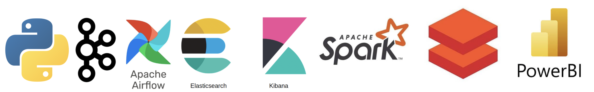

# Garret Gallo

### **`Digital Data Craftsman`**  
`Data Engineering` | `Analytics and Visualization` | `Cloud Engineering`

As a data and analytics engineer, I design scalable data infrastructures by transforming 
raw and unstructured data into optimized pipelines, warehouses, and analytics-ready models. 

I’ve built complex end-to-end pipelines with Python and Amazon Web Services, as well as orchestrated 
workflows with Apache Airflow. Additionally, I've implemented distributed streaming and transformations 
with Apache Kafka and Spark. I’ve also designed scalable data storage infrastructure across various data 
lakehouses and warehouses. These tools and skills have enabled me to deliver business-ready insights and 
prepare high-qualilty data for machine learning and AI applications.

#
      
### :hammer: Toolkit :hammer:

### :page_with_curl: Certifications :page_with_curl:

  
  

#

### :bar_chart: Project Highlights :bar_chart:
<table style="width:100%; border-collapse:collapse;">
  <!-- ROW 1 -->
  <tr>
    <td valign="top" style="width:33%; padding:14px 12px; border:1px solid #30363d;">
      
<strong>💰 Real-Time Financial Institution ETL Pipeline</strong>

      

      

        Real-time ETL simulating financial transactions using AWS S3, Glue, Redshift, and Kinesis.
      

      <!-- Technologies Used -->
      

            <em>Techstack</em>
             
            
             
            🔗 <a href="https://github.com/GarretGallo/InstitutionFinancial">View Repo</a>
            

    </td>
    <td valign="top" style="width:33%; padding:14px 12px; border:1px solid #30363d;">
      
<strong>🎵 Music Streaming Platform AWS Project</strong>

      

      

        Scalable AWS platform for ingesting & analyzing playback data with AWS, Kafka and Spark.
      

        <!-- Technologies Used -->
      

            <em>Techstack</em>
             
            
             
            🔗 <a href="https://github.com/GarretGallo/MusicStreamingPlatform">View Repo</a>
            

    </td>
    <td valign="top" style="width:33%; padding:14px 12px; border:1px solid #30363d;">
      
<strong>🏙️ Smart City AWS Project</strong>

      

      

        Simulated IoT streams for traffic, weather, and emergency systems using Kafka, Spark, and AWS.
      

    <!-- Technologies Used -->
      

            <em>Techstack</em>
             
            
             
            🔗 <a href="https://github.com/GarretGallo/aws-smart-city-project">View Repo</a>
            

    </td>
  </tr>

  <!-- ROW 2 -->
  <tr>
    <td valign="top" style="width:50%; padding:14px 12px; border:1px solid #30363d;">
      
<strong>📈 VGC Analytics Pipeline</strong>

      

      

        Analyzed 38K+ teams & 225K+ Pokémon from over 75 major tournaments using Python, MySQL, and Power BI.
      

      <!-- Technologies Used -->
      

            <em>Techstack</em>
             
            
             
            🔗 <a href="https://github.com/GarretGallo/Pokemon_Stats">View Repo</a>
            

    </td>
    <td valign="top" style="width:50%; padding:14px 12px; border:1px solid #30363d;">
      
<strong>🧪 IoT Gas Monitor Data Pipeline</strong>

      

      

        ETL for H₂S sensor data into MySQL + Power BI for real-time monitoring.
      

      <!-- Technologies Used -->
      

            <em>Techstack</em>
             
            
             
            🔗 <a href="https://github.com/GarretGallo/EnhancedGasMonitorPipeline">View Repo</a>
            

    </td>
  </tr>
</table>

#

### :newspaper: My Latest Articles on Medium :newspaper:

#

### :hammer: What I am Currently Working on :hammer:
**Certifications**
  - DataBricks Apache Spark Developer

**Projects**
 - Enhanced Gas Monitor ETL Pipeline
